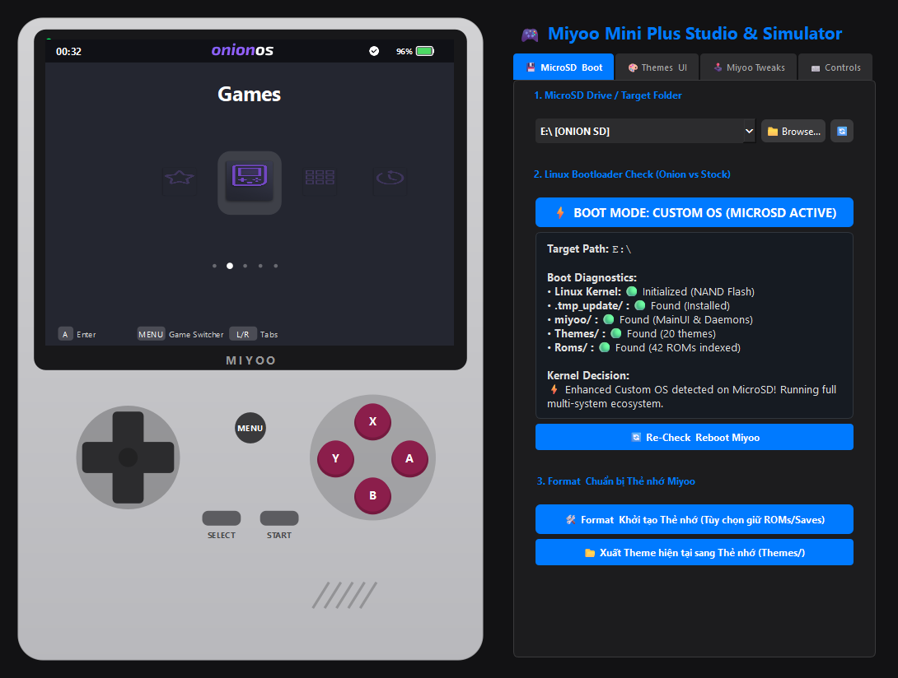

# 🎮 Miyoo Mini Plus Simulator & MicroSD Studio

<p align="center">
  <a href="README.md"><b>English</b></a> | <a href="README.vi.md"><b>Tiếng Việt</b></a>
</p>

<p align="center">
  
  
  
  
  
</p>

A 1:1 hardware simulator and universal MicroSD management studio for the **Miyoo Mini Plus** retro handheld console on Windows.

---

## 📸 Application Preview



---

## ✨ Key Features

### 1. 🎮 1:1 Pixel-Perfect Miyoo Mini Plus Hardware Simulation
* **Hardware-Accurate Display:** Precise 4:3 aspect ratio rendering at native $640 	imes 480$ IPS resolution.
* **4 Authentic Shell Colorways:** Instantly switch between classic shell designs:
  * 🔘 **Retro Grey** (Classic Game Boy DMG grey)
  * ⬛ **Transparent Black** (Smoky semi-transparent)
  * ⚪ **Pure White** (Clean modern white)
  * 🟣 **Transparent Purple** (Atomic purple semi-transparent)
* **Physical Button Interactions:** Click buttons directly on the console casing (D-Pad, A/B/X/Y, START, SELECT, MENU) or use keyboard shortcuts / USB gamepads.

### 2. 💾 Universal MicroSD Manager & Multi-OS Linux Boot Diagnostics
* **High-Speed Drive Detection:** Scans inserted MicroSD cards / USB Card Readers via Windows Kernel API (`GetLogicalDrives`) in 0.01 ms.
* **Multi-OS Boot Analyzer:**
  * ⚡ **Custom OS:** Detects custom firmware ecosystem directly from MicroSD.
  * ⚙️ **Stock OS:** Factory firmware interface emulation from internal NAND Flash.
  * 🔲 **MinUI / Koriki / Batocera / Allium:** Compatible boot structure inspection.
  * ⚠️ **Recovery / No SD:** Visual alerts when SD card is missing or unformatted.

### 3. 🎨 Live Theme Studio & UI Customizer
* **Direct MicroSD Theme Scanning:** Live index of all themes located in `Themes/` on the selected card.
* **Live Theme Preview:** Instant preview of wallpapers (`background.png`), system icons, navigation bars, fonts, and color palettes (Title, Battery, Hints).
* **Integrated Audio Engine:** Real-time playback of background music (BGM) and navigation sound effects (SFX: Nav, Select, Back).
* **1-Click Theme Export:** Export customized themes directly back to the MicroSD card.

### 4. 🕹️ Multi-System ROM Scanner & Game Switcher
* Automatically indexes ROMs across supported emulator directories: `GBA`, `PS`, `SFC`, `FC`, `NDS`, `ARCADE`, `PICO`, `MD`, `GBC`, `GB`, `NEOGEO`, `PORTS`.
* Fast **Favorites** pinning and interactive **Game Switcher** overlay.

### 5. 🛠️ Safe SD Card Initializer & Formatting Tool
* Automatically initializes the official Miyoo folder structure:
  ```
  SD_CARD/
  ├── Roms/          (GBA, PS, SFC, FC, NDS, MD, ARCADE...)
  ├── Saves/         (Game saves & save states)
  ├── BIOS/          (System BIOS files)
  ├── Themes/        (Custom themes)
  └── Screenshots/   (In-game screenshots)
  ```
* **Data Protection Mode:** Safely backs up existing ROMs, Saves, and BIOS files before reformatting.

---

## 🚀 Quick Start Guide

### Option 1: Standalone Portable Release (Recommended — No Python Required)
1. Navigate to the **`windows/`** folder.
2. Double-click **`MiyooPlusSimulator.exe`**.
3. The application launches instantly with zero setup required.

### Option 2: Run from Source (For Developers)
Requires Python 3.10+.

```bash
# 1. Install dependencies
pip install PyQt6 pygame

# 2. Launch the application
python run.py
```

---

## ⌨️ Controls & Keybindings Mapping

| Keyboard Key | Miyoo Button | Action |
| :--- | :--- | :--- |
| `W` / `A` / `S` / `D` or `Arrow Keys` | **D-Pad** | Navigate Up / Down / Left / Right |
| `J` or `Enter` | **A Button** | Select / Open Game / Confirm |
| `K` or `Escape` | **B Button** | Back / Cancel |
| `U` | **X Button** | Toggle Favorite / Secondary Action |
| `I` | **Y Button** | Context Menu |
| `M` or `Space` | **MENU Button** | Open Game Switcher Overlay |
| `Q` / `E` | **L1 / R1** | Switch Categories / Previous & Next Tab |
| `Left Mouse Click` | **Physical Casing Buttons** | Direct click on any button on the console casing |

---

## 📁 Repository Structure

```
miyoo-plus-simulator/
├── assets/                  # Vector icons & app assets
│   └── icons/
├── docs/                    # Documentation & screenshots
│   └── screenshots/
├── simulator/               # Core application source code
│   ├── control_deck.py      # Studio sidebar & 4-tab control panel
│   ├── handheld_frame.py    # 4-color handheld casing & physical button hitboxes
│   ├── main.py              # Main window & component integration
│   ├── models.py            # Data models, ROM indexing & boot diagnostics
│   ├── screen_canvas.py     # 640x480 pixel-perfect canvas & UI renderers
│   └── theme_manager.py     # Theme loader & BGM/SFX audio engine
├── tests/                   # Automated regression test suite
│   └── test_simulator.py
├── tools/                   # Windows portable build automation
│   ├── build_exe.py
│   └── build_exe.bat
├── windows/                 # Standalone Windows portable distribution
│   ├── _internal/           # Compiled binary DLLs & Python runtime
│   ├── assets/
│   ├── LICENSE
│   ├── README.md
│   └── MiyooPlusSimulator.exe
├── run.py                   # Python entry point
├── README.md                # English Documentation (Default)
├── README.vi.md             # Vietnamese Documentation
└── LICENSE
```

---

## 🛠️ Rebuilding the Windows Portable (.exe)

To rebuild the standalone Windows distribution after making changes:
```bash
python tools/build_exe.py
```
Or double-click `tools/build_exe.bat`. The updated executable and assets will be output to `windows/`.

---

## 📄 License

This project is licensed under the **MIT License**. You are free to use, modify, and distribute it.
